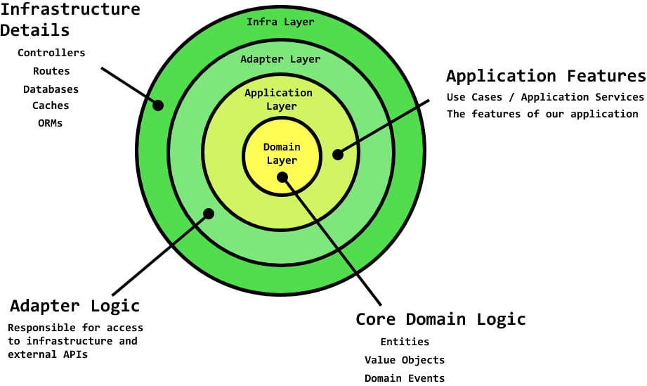

# application Layers



Nesta aplicação temos algumas camadas que separam responsabilidades.

*   **main.ts:** index do projeto, onde inicia todas as outras responsabildades.
*   **app:** O core do projeto, onde as camadas da aplicação são definidas.
*   **config:** Definição de objetos de configuração.
*   **prisma:** Onde o DTO prisma defines os modelos para criar os tipos e tabelas do banco.
*   **types:** Onde os tipos da aplicação são definidos

```
server
   ├─ main.ts
   ├─ app
   ├─ config
   ├─ prisma
   └─ types
```

## App
Esta pasta separa algumas responsabilidades como,

* **Infra:** A primeira a ser acessada, que trata tudo que é concreto, como as implementações das interfaces, definindo todo o setup da aplicação.
* **Core:** A camanda que define as classes e interfaces primordiais. Entretanto a maior parte dos tipos, classes e interfaces foi movido para a pasta *types* de modo a ter um local de fácil acesso para importar os tipos da aplicação.


```
  app
    ├─ core
    │  ├─ domain
    │  └─ infra
    ├─ infra
    │  ├─ http
    │  ├─ middlewares
    │  └─ prisma
    └─ Modules
```

------------

```
server
   ├─ app
   │  ├─ core
   │  │  ├─ domain
   │  │  └─ infra
   │  │     ├─ adapters
   │  │     │  ├─ ExpressMiddlewareAdapter.ts
   │  │     │  └─ ExpressRouteAdapter.ts
   │  │     ├─ IController.ts
   │  │     ├─ IMapper.ts
   │  │     ├─ IUseCase.ts
   │  │     └─ Middleware.ts
   │  ├─ infra
   │  │  ├─ http
   │  │  │  ├─ factories
   │  │  │  │  ├─ controllers
   │  │  │  │  │  ├─ AuthenticateUserControllerFactory.ts
   │  │  │  │  │  └─ makeRegisterUserController.ts
   │  │  │  │  └─ middlewares
   │  │  │  │     └─ EnsureAuthenticatedMiddlewareFactory.ts
   │  │  │  ├─ Routes
   │  │  │  │  ├─ sessions.routes.ts
   │  │  │  │  └─ users.routes.ts
   │  │  │  └─ server.ts
   │  │  ├─ middlewares
   │  │  │  └─ EnsureAuthenticatedMiddleware.ts
   │  │  └─ prisma
   │  └─ Modules
   │     └─ user
   │        ├─ domain
   │        │  ├─ jwt.ts
   │        │  ├─ Password.ts
   │        │  └─ Username.ts
   │        ├─ errors
   │        ├─ mapper
   │        │  └─ UserMapper.ts
   │        ├─ repositories
   │        │  ├─ IUsersRepository.ts
   │        │  └─ prisma
   │        │     └─ PrismaUserRepository.ts
   │        └─ useCases
   │           ├─ AuthenticateUser
   │           └─ RegisterUser
   ├─ config
   ├─ main.ts
   ├─ prisma
   │  └─ schema.prisma
   ├─ types
   │  ├─ DTOs
   │  ├─ entities
   │  ├─ enums
   │  ├─ errors
   │  └─ HttpResponses
```